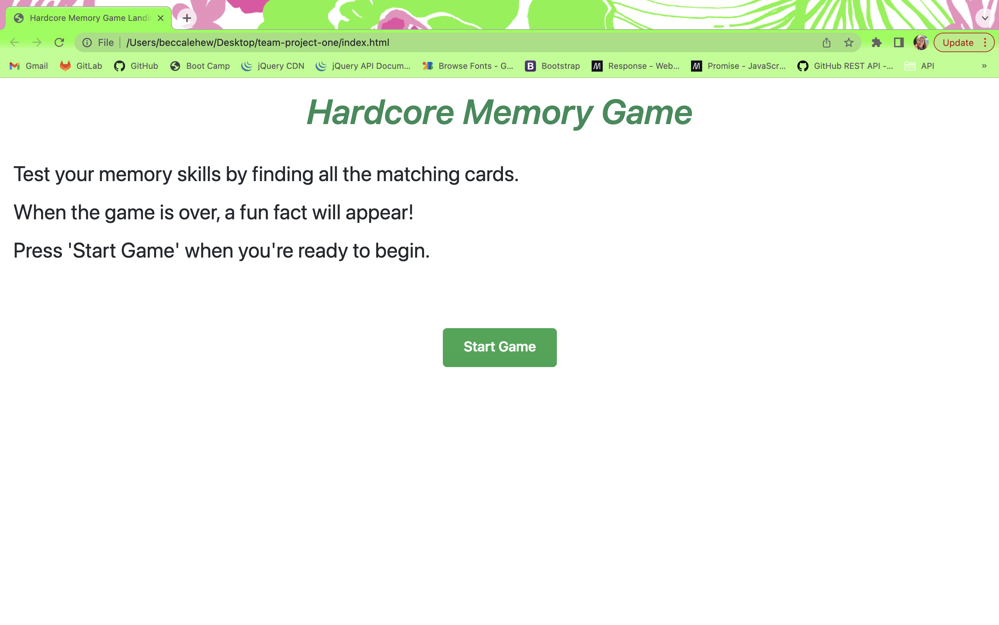
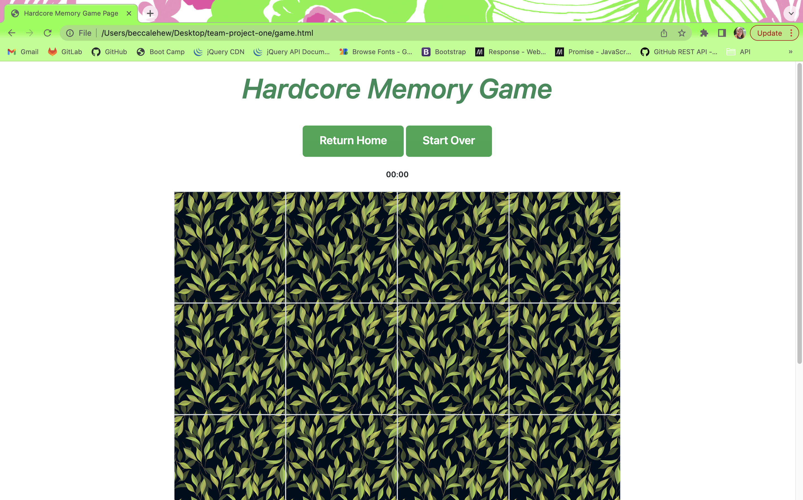

# Hardcore Memory Game


## Description:
The "Hardcore Memory Game" tests a user's ability to remember where matching images are located. When the user clicks start game, the count-up timer begins. Images are loaded to 16 cards from the Flickr server-side API. The cards will flip over when clicked, and the user will be alerted when the cards match or do not match. Once all the cards are matched, the timer stops, facts about an animal (pulled from the Animal API Ninja server-side APIU) will pop up, and the user will be able to enter their initials to save their time to local storage. This allows the user to return the game and try to beat their score. 

Deployed URL: https://juliaguas17.github.io/team-project-one/


## User Story:
```
As a hardcore gamer who fears memory loss,
I want to play a memory card matching game,
so that I may reduce the effects of potential dementia.
```


## Acceptance Criteria:

- When the user navigates to the Hardcore Memory Game, then the landing page with game instructions will load.
- When the start game button is clicked, the user will be navigated to the game page and the count-up timer will begin.
- When the user clicks a card, the card will flip over revealing an image fetched from the Flickr server-side API.
- When the user selects a pair of cards that match, an alert pops up stating a match was found.
- When the user selects a pair of cards that do not match, an alert pops up stating the cards do not match.
- When all the cards are matched, the timer will stop.
- When the timer stops, a series of animal facts will pop up, fetched from the Animal API Ninja server-side API.
- When the user clicks out of the animal fact alert, the user is prompted to enter their initials as a high score.
- When the user clicks submit, the high score data is saved to local storage.
- When the time is saved, the user can leave the app or click the return home button to play again.


## Mock-Up:




## Collaborators:
GitHub:
- Theresa Corsaut // theresacorsaut
- Jennifer Engle // jengle-dev
- Rebecca Lehew // rebeccalehew
- Julianne Waters // juliaguas17


## Future Development:
- Create multiple themes for the card images that the user can choose from
- Allow user to choose number of cards in the game
- Making the game two player
- Figure out how to narrow down the Flickr image search